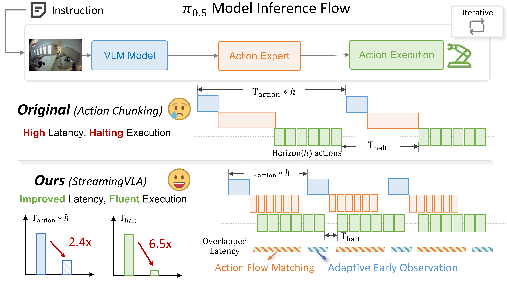
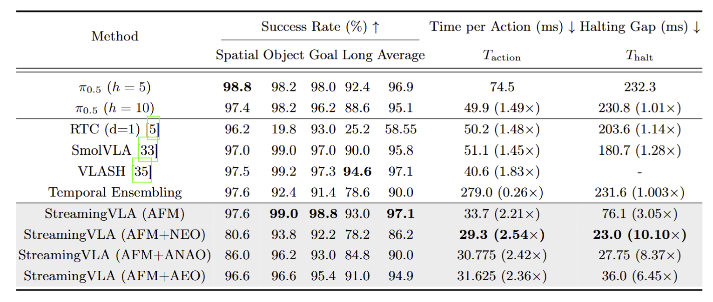

# StreamingVLA

<a href="https://arxiv.org/abs/2603.28565">
  
</a>
<a href="https://ghahahahag.github.io/StreamingVLA_Website/">
    
</a>

Official project page and resources for:

**StreamingVLA: Streaming Vision-Language-Action Model with Action Flow Matching and Adaptive Early Observation**

## Overview

Vision-Language-Action (VLA) models are powerful for language-conditioned robot control, but real-world deployment is often limited by high latency and frequent execution halts.

StreamingVLA addresses this issue by enabling asynchronous, streaming-style coordination across observation, action generation, and action execution. Instead of waiting for each stage to fully finish before the next stage begins, StreamingVLA overlaps critical stages to reduce idle time while maintaining task success.

<p align="center">
  
</p>

## Key Ideas

### 1) Action Flow Matching (AFM)

Traditional VLA pipelines generate action chunks first and execute later, which creates unavoidable waiting gaps.

StreamingVLA replaces chunk-wise denoising with a state-based action flow matching formulation:
- The model maintains an internal action-space state.
- It predicts a velocity field to evolve that state over time.
- Each action can be produced and executed immediately, while the next action is being generated.

This enables effective overlap between action generation and execution.

### 2) Adaptive Early Observation (AEO)

After reducing generation-execution gaps, observation-execution serialization becomes the next bottleneck.

StreamingVLA introduces adaptive early observation:
- A Transformer predictor estimates action saliency (how much pending actions will change future observations).
- If predicted change is small, the next observation starts early.
- If predicted change is large, observation will not start early to maintain accuracy.

This adaptively overlaps observation and execution while controlling performance risk.

## Why StreamingVLA Matters

StreamingVLA shows that improving embodied AI efficiency is not only about model compression. System-level scheduling and stage parallelism can provide major gains in fluency and responsiveness without sacrificing capability.

The streaming design principle can also inspire other multi-stage, multi-modal real-time interactive systems.

## Installation

When cloning this repo, make sure to update submodules:

```bash
git clone --recurse-submodules git@github.com:gen-robot/StramingVLA.git

# Or if you already cloned the repo:
git submodule update --init --recursive
```

We use [uv](https://docs.astral.sh/uv/) to manage Python dependencies. See the [uv installation instructions](https://docs.astral.sh/uv/getting-started/installation/) to set it up. Once uv is installed, run the following to set up the environment:

```bash
GIT_LFS_SKIP_SMUDGE=1 uv sync
GIT_LFS_SKIP_SMUDGE=1 uv pip install -e .
```

NOTE: `GIT_LFS_SKIP_SMUDGE=1` is needed to pull LeRobot as a dependency.

## Model Checkpoints

We provide pretrained StreamingVLA model, which is fine-tuned from the official $\pi_{0.5}$ model(https://github.com/Physical-Intelligence/openpi). 
| Model        | Checkpoint Path|
| ------------ | ---------------------------------------------- |
| StreamingVLA_libero | `https://huggingface.co/Yiran-Shi/StreamingVLA_LIBERO`  |
| StreamingVLA_libero_predictor |`https://huggingface.co/Yiran-Shi/StreamingVLA_LIBERO_Predictor` |

*Note: The path of `StreamingVLA_libero_predictor` should be added to the [StreamingVLA Model Definition](src/openpi/models_pytorch/svla_pytorch.py) in order to be loaded properly.

## Training StreamingVLA Models on Your Own Data
We will fine-tune the $\pi_{0.5}$-LIBERO model on the [LIBERO dataset](https://libero-project.github.io/datasets) as a running example for how to train a streamingvla model on your own data. 

### 1. Convert your data to a LeRobot dataset

We provide a minimal example script for converting LIBERO data to a LeRobot dataset in [`examples/libero/convert_libero_data_to_lerobot.py`](examples/libero/convert_libero_data_to_lerobot.py). You can easily modify it to convert your own data! You can download the raw LIBERO dataset from [here](https://huggingface.co/datasets/openvla/modified_libero_rlds), and run the script with:

```bash
uv run examples/libero/convert_libero_data_to_lerobot.py --data_dir /path/to/your/libero/data
```

To train StreamingVLA, we need to incorporate state information from the action space. You can preprocess the dataset by running:

```bash
python scripts/preprocess_dataset.py --dataset_dir /path/to/your/lerobot/data
```

### 2. Defining training configs and running training

To fine-tune a base model on your own data, you need to define configs for data processing and training. We provide example configs with detailed comments for LIBERO below, which you can modify for your own dataset:

- [`LiberoInputs` and `LiberoOutputs`](src/openpi/policies/libero_policy.py): Defines the data mapping from the LIBERO environment to the model and vice versa. Will be used for both, training and inference.
- [`LeRobotLiberoDataConfig`](src/openpi/training/config.py): Defines how to process raw LIBERO data from LeRobot dataset for training.
- [`TrainConfig`](src/openpi/training/config.py): Defines fine-tuning hyperparameters, data config, and weight loader.

Before we can run training, we need to compute the normalization statistics for the training data. Run the script below with the name of your training config:

```bash
uv run scripts/compute_norm_stats_new.py --config-name streamingvla_pi05_libero
```

Now we can kick off training with one of the following commands:

```bash
# Single GPU training:
uv run scripts/train_pytorch.py <config_name> --exp_name <run_name> --save_interval <interval>

# Example:
uv run scripts/train_pytorch.py streamingvla_pi05_libero --exp_name pytorch_test
uv run scripts/train_pytorch.py streamingvla_pi05_libero --exp_name pytorch_test --resume  # Resume from latest checkpoint

# Multi-GPU training (single node):
uv run torchrun --standalone --nnodes=1 --nproc_per_node=<num_gpus> scripts/train_pytorch.py <config_name> --exp_name <run_name>

# Example:
uv run torchrun --standalone --nnodes=1 --nproc_per_node=2 scripts/train_pytorch.py streamingvla_pi05_libero --exp_name pytorch_ddp_test
uv run torchrun --standalone --nnodes=1 --nproc_per_node=2 scripts/train_pytorch.py pi0_aloha_streamingvla_pi05_liberosim --exp_name pytorch_ddp_test --resume

# Multi-Node Training:
uv run torchrun \
    --nnodes=<num_nodes> \
    --nproc_per_node=<gpus_per_node> \
    --node_rank=<rank_of_node> \
    --master_addr=<master_ip> \
    --master_port=<port> \
    scripts/train_pytorch.py <config_name> --exp_name=<run_name> --save_interval <interval>
```
## Running Inference

We provide an example on [LIBERO Benchmark](examples/libero/README.md).

## Main Results

### LIBERO Simulation

- Success rate: **94.9%** (close to baseline **95.1%**)
- Single-action latency: **49.9 ms -> 31.6 ms**
- End-to-end latency speedup: up to **2.4x**
- Execution halting reduction: **230.8 ms -> 36.0 ms** (about **6.5x**)

<p align="center">
  
</p>

### Real-World Robot (Franka Panda)

- Task: grasp-and-place on a desktop setup
- Average action latency: **271.49 ms -> 170.88 ms**
- Real-world speedup: about **1.58x**

## Citation

```bibtex
@misc{shi2026streamingvlastreamingvisionlanguageactionmodel,
  title={StreamingVLA: Streaming Vision-Language-Action Model with Action Flow Matching and Adaptive Early Observation},
  author={Yiran Shi and Dongqi Guo and Tianchen Zhao and Feng Gao and Liangzhi Shi and Chao Yu and ZhiJian Mo and Qihua Xiao and XiaoShuai Peng and Qingmin Liao and Yu Wang},
  year={2026},
  eprint={2603.28565},
  archivePrefix={arXiv},
  primaryClass={cs.RO},
  url={https://arxiv.org/abs/2603.28565}
}
```
